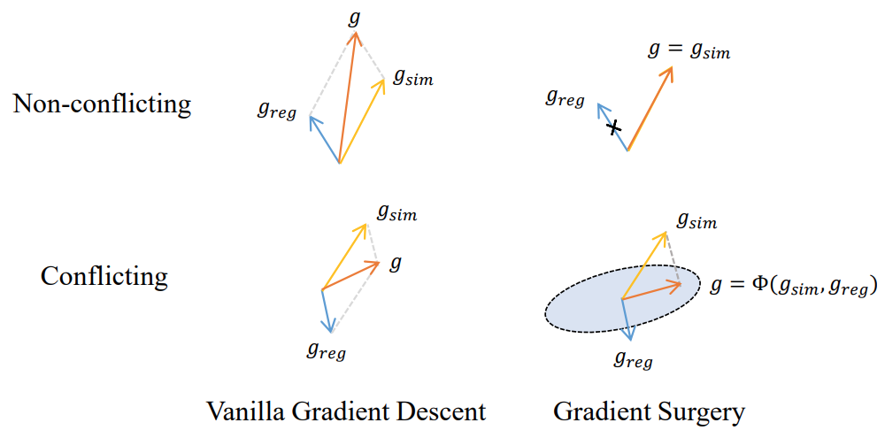
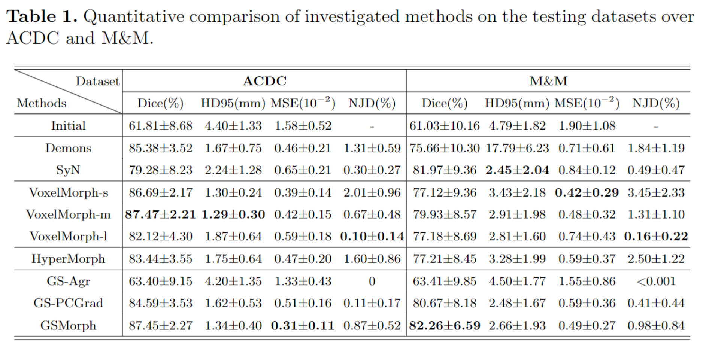

# GSMorph
This repository is the implementation of the GSMorph for deformable image registration by Haoran Dou in CISTIB at University of Leeds.

**GSMorph: Gradient Surgery for cine-MRI Cardiac Deformable Registration.**  
*Haoran Dou, Ning Bi, Luyi Han, Yuhao Huang, Ritse Mann, Xin Yang, Dong Ni, Nishant Ravikumar, Alejandro F. Frangi, Yunzhi Huang.*  
International Conference on Medical Image Computing and Computer Assisted Intervention, 2023. [[arXiv]](https://arxiv.org/abs/2306.14687)


> Deep learning-based deformable registration methods have been widely investigated in diverse medical applications. Learning-based deformable registration relies on weighted objective functions trading off registration accuracy and smoothness of the deformation field. Therefore, they inevitably require tuning the hyperparameter for optimal registration performance. Tuning the hyperparameters is highly computationally expensive and introduces undesired dependencies on domain knowledge. In this study, we construct a registration model based on the gradient surgery mechanism, named GSMorph, to achieve a hyperparameter-free balance on multiple losses. In GSMorph, we reformulate the optimization procedure by projecting the gradient of similarity loss orthogonally to the plane associated with the smoothness constraint, rather than additionally introducing a hyperparameter to balance these two competing terms. Furthermore, our method is model-agnostic and can be merged into any deep registration network without introducing extra parameters or slowing down inference. In this study, We compared our method with state-of-the-art (SOTA) deformable registration approaches over two publicly available cardiac MRI datasets. GSMorph proves superior to five SOTA learning-based registration models and two conventional registration techniques, SyN and Demons, on both registration accuracy and smoothness.

## Usage

### How to Run
The whole repository was implemented by PyTorch, some third-party libraries are required, e.g., wandb, numpy, scipy, opencv, nibabel, skimage, SimpleITK etc. 

- Run `python TrainModel.py` to train the model.
- Run `python Inference.py` to infer the model.

## Results


## Citation
If this work is helpful for you, please cite our paper as follows:
```
@article{dou2023gsmorph,
  title={GSMorph: Gradient Surgery for cine-MRI Cardiac Deformable Registration},
  author={Dou, Haoran and Bi, Ning and Han, Luyi and Huang, Yuhao and Mann, Ritse and Yang, Xin and Ni, Dong and Ravikumar, Nishant and Frangi, Alejandro F and Huang, Yunzhi},
  journal={arXiv preprint arXiv:2306.14687},
  year={2023}
}
```

